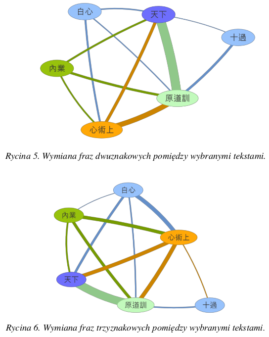

# My Programming Journey

This repository outlines my IT experience, presenting the progress and projects I made throughout my programming journey. Apart from learning about my background, I will be providing excerpts from code I have written (anonymized where necessary).

# The Beginnings

## edX Course

### < 1y Python experience

**Stack: Python (Jupyter Notebook)**

It all started with [Microsoft's Python course on edX](https://learning.edx.org/course/course-v1:Microsoft+DEV236x+1T2017/home). It was my first experience with for loops, while statements, functions, if/else, etc. I found the topic extremely interesting and completed the whole course, learning about the basics of programming in the process. Below is the final assignment diagram:

#### [Link to my solution](edX%20Course/adding_report.py)

 

## Bachelor's Thesis

Back then I only wanted to learn Python for my research in general and my Bachelor's thesis in particular. I was able to apply this newly obtained skill into my thesis, graphing out text reuse between several ancient Chinese texts. The inclusion of digital humanities section was met with much interest and recognition from the reviewers.

# Leiden University

## Attending the _Constructing Digital Language Toolkits_ Class

### < 1y Python experience

**Stack: Python, Django, HTML, CSS**

One of my motivations for applying for a Master's Degree in Chinese Studies in Leiden was my growing interest in digital humanities. They had a class called _Constructing Digital Language Toolkits_, which was exactly what I wanted at the time. Combining programming with my major and interests, that sounded great. And it was great!

The course was taught by [Dr. Christopher Handy](https://github.com/handyc), an amazing person to whom I owe a lot, since he enabled me to delve deeper into the world of programming. During this one-semester course we were learning the basics of unix systems and command line, SQL databases, HTML, CSS, JavaScript, Python, and Django.

Fueled by a deep passion for the subject I went far and beyond with my final project. I created a full-fledged, responsive (albeit a bit ugly) website converting Chinese units and measurements into their Western counterparts.

Definitely the biggest achievement at this point was the creation of a pretty complex algorithm converting Chinese numerals into Arabic numbers. Since there were no real examples (and one algorithm written in Perl actually had erroneous output in many cases) I had to create it from ground-up. Here's the code if you're interested (types were added later) and some examples:

一千二百三十四亿五千六百七十八万九千 --> 123456789000

四千万零一十 --> 40000010

二亿五千四百三十一万五千 --> 254315000

#### [Algorithm converting Chinese numerals into Arabic numbers](Python%20converter/converter_trillion.py)

#### [Test cases](Python%20converter/converter_test.py)

 

## Researching China’s Role in Cyber Security

While in Leiden, I was lucky enough to get hired for a research assistant position at [Leiden Asia Centre](https://leidenasiacentre.nl/), a leading European thin-tank specializing in Asia. Although the bulk of my responsibilities were research- or translation- related, with some Airtable added to the mix, it was a great learning experience for me, solidifying my overall understanding of cyberspace and tech in general.

You can even find me as the co-author of a paper released by LAC: _[How Asia Confronts COVID-19 through Technology](https://leidenasiacentre.nl/how-asia-confronts-covid-19-through-technology-2/)_.

 

## Web Content Creator for OpenPhilology

**Stack: Grav CMS, HTML, CSS**

Creating web content for OpenPhilology was my other part-time job back then. Apart from learning more about Buddhism and helping out the team with internal tasks, I was working with Grav CMS (sometimes sprinkled with some basic HTML and CSS). This in turn introduced me to YAML files and their syntax. Slowly but surely, I was adding new tools to my toolbox.

 

## TAing for _Constructing Digital Language Toolkits_ Class

**Stack: Python (Pandas, Matplotlib), Django, Bash**

As the new academic year started, I was asked by Dr. Handy whether I'd be open to become the Teaching Assistant for his class. I loved the idea and immediately agreed.

I was tasked with tutoring students and helping them with their homeworks and final projects. However, since the class was taking place online, with students having to log into the server, I created a tool tracking students' presence on the server.

As you can see, the last few days before the final deadline were hectic! I was also spending most of my time helping students with their projects. Most were done in Django, making it a good practice for me as well. Some created basic websites, others opted for specialized dictionaries, one person even made an Anki-like flashcards app.

The class was a huge success and many more students handed out their final assignments than years prior!
